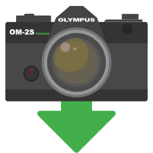

# Copy And Sort

Godot-based GUI application to copy files from one directory (or storage medium) to another, while also sorting them by date on the target location

Pick a target folder, and the program will create folders for year and month.

Created because i wanted a standalone tool to copy pictures from an SD card and back them up with a single click

